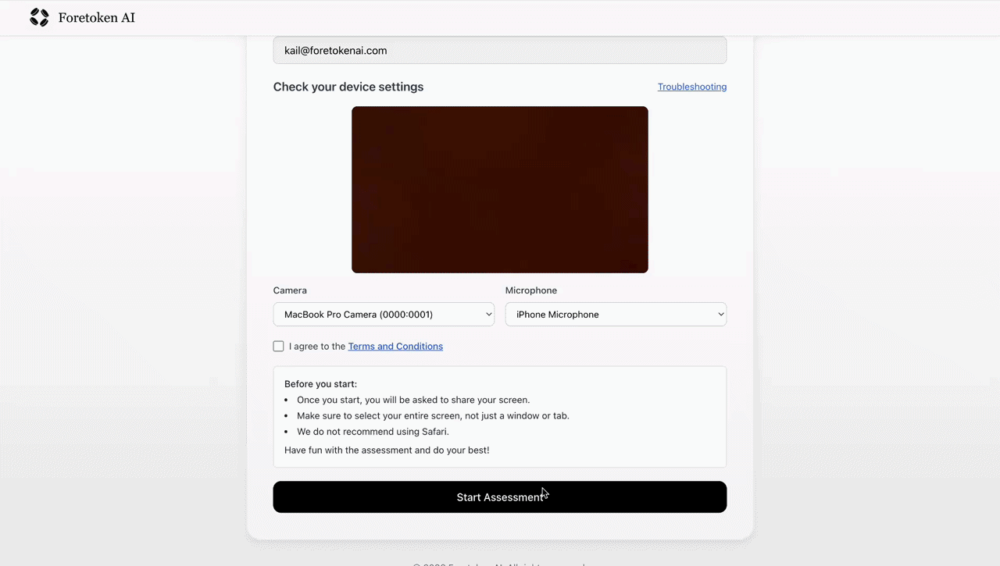

# InterviewOS

<p align="center">
  
</p>

<p align="center">
  <strong>Replace coding puzzles with real-work simulations.</strong><br/>
  Open infrastructure for production-grade technical assessments.
</p>

<p align="center">
  <a href="./LICENSE"></a>
  <a href="#run-locally-in-one-command"></a>
  <a href="#status"></a>
</p>

---

## What is InterviewOS?

InterviewOS helps teams evaluate candidates through job-relevant tasks instead of algorithm puzzles.

Candidates complete realistic assignments using their normal tools. InterviewOS records the full workflow and generates structured evaluation reports so reviewers can see:

- what the candidate shipped
- how they approached the work
- how they debugged, used tools, and made tradeoffs
- how they explained decisions along the way

Not just output. The process.

---

## How it works

### 1) Create an assessment

<p align="center">
  
</p>

Define the task, add follow-up questions, and configure reporting requirements.

### 2) Invite a candidate

<p align="center">
  
</p>

Send a secure link. No account setup required.

### 3) Candidate completes the work end-to-end

<p align="center">
  
</p>

Candidates work normally using their preferred tools. InterviewOS captures the workflow and responses.

### 4) Review a structured report

<p align="center">
  
</p>

Reviewers get a high-signal summary plus the underlying evidence needed for calibration.

---

## Why InterviewOS exists

Hiring is still optimized for puzzle performance. Modern engineering is not.

Real work involves:

- debugging unfamiliar code
- reading and applying documentation
- using AI tools responsibly
- working through ambiguity
- communicating tradeoffs and decisions

Short algorithm challenges rarely measure these skills. InterviewOS is opinionated: real work beats rehearsed tricks.

---

## InterviewOS vs traditional coding interviews

| Traditional puzzle interviews | InterviewOS |
|---|---|
| tests memorization and prep | tests job-relevant execution |
| output-focused | workflow and decision-focused |
| easy to game | harder to fake |
| no realistic context | realistic tasks and constraints |
| weak reviewer calibration | evidence-rich review (recording + report) |

---

## Run locally in one command

Prerequisite: Docker Desktop running.

```bash
make dev
````

This starts:

* Frontend: [http://localhost:5173](http://localhost:5173)
* Backend API: [http://localhost:8000](http://localhost:8000)
* Local email inbox (Mailpit): [http://localhost:8025](http://localhost:8025)

A bundled sample assessment is included so you can test the full flow immediately.

---

## What works today

* end-to-end invite flow with frontend + backend
* `POST /assessments/start` plus legacy `POST /start-assessment`
* invite lifecycle APIs: bulk send, resend, verify token, and mark-taken
* local out-of-box mode (no AWS account required)
* bundled sample assessment archive for immediate testing
* local SMTP inbox via Mailpit in Docker Compose
* admin dashboard foundation at `/dashboard` backed by:
  * `GET /api/assessments`
  * `GET /api/candidates?assessmentId=<id>`
* candidate route placeholder at `/take-assessment` (reserved for upcoming full candidate flow)

---

## Architecture (high level)

InterviewOS is split into:

* `frontend/`: candidate and admin UI
* `backend/`: API, invite lifecycle, local SQLite state, assessment packaging, and core workflow
* `docker-compose.yml`: local end-to-end dev environment (including Mailpit)

For development details, see [CONTRIBUTING.md](CONTRIBUTING.md).

---

## Roadmap

Planned next steps:

* admin assessment creation flow parity (`NewAssessment` + `QuestionSelection`)
* assessment result view with invite-management parity
* candidate execution flow parity (`Assessment` / `TakeAssessment`)
* submission upload pipeline and recording multipart pipeline
* structured candidate report viewing parity (`newreport`)
* automated evaluation and rubric scoring
* ATS and webhook integrations

---

## Status

InterviewOS is early stage and moving quickly. Core migration is currently through dashboard foundation (`PR-04`) with invite flow and provider architecture in place.

If you try it and hit sharp edges, please open an issue. Feature requests and PRs are welcome.

---

## Contributing

See [CONTRIBUTING.md](CONTRIBUTING.md).

---

## Security

See [SECURITY.md](SECURITY.md). Please report sensitive issues responsibly.

---

## Hosted version

InterviewOS is the open infrastructure.

If you prefer a fully managed platform with ready-to-use simulations, automated scoring, and enterprise features:

[https://foretokenai.com](https://foretokenai.com)

---

## License

MIT. See [LICENSE](LICENSE).
