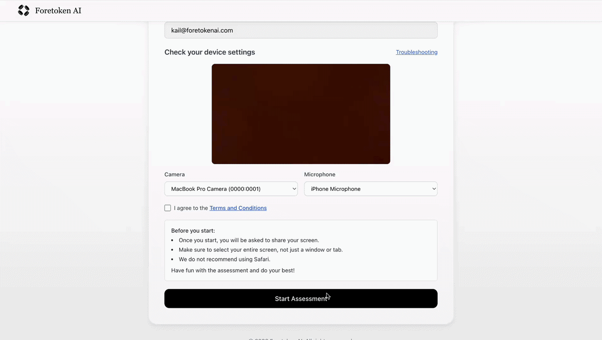

# InterviewOS

<p align="center">
  
</p>

<p align="center">
  <strong>Replace coding puzzles with real-work simulations.</strong><br/>
  Open infrastructure for production-grade technical assessments.
</p>

<p align="center">
  <a href="./LICENSE"></a>
  <a href="#run-locally-in-one-command"></a>
  
</p>

---

## What is InterviewOS?

InterviewOS helps teams evaluate candidates through job-relevant tasks instead of algorithm puzzles.

Candidates complete realistic assignments using their normal tools. InterviewOS records the full workflow and generates structured evaluation reports so reviewers can see:

- what the candidate shipped
- how they approached the work
- how they debugged, used tools, and made tradeoffs
- how they explained decisions along the way

Not just output. The process.

---

## How it works

### 1) Create an assessment

<p align="center">
  
</p>

Define the task, add follow-up questions, and configure reporting requirements.

### 2) Invite a candidate

<p align="center">
  
</p>

Send a secure link. No account setup required.

### 3) Candidate completes the work end-to-end

<p align="center">
  
</p>

Candidates work normally using their preferred tools. InterviewOS captures the workflow and responses.

### 4) Review a structured report

<p align="center">
  
</p>

Reviewers get a high-signal summary plus the underlying evidence needed for calibration.

---

## Why InterviewOS exists

Hiring is still optimized for puzzle performance. Modern engineering is not.

Real work involves:

- debugging unfamiliar code
- reading and applying documentation
- using AI tools responsibly
- working through ambiguity
- communicating tradeoffs and decisions

Short algorithm challenges rarely measure these skills. InterviewOS is opinionated: real work beats rehearsed tricks.

---

## InterviewOS vs traditional coding interviews

| Traditional puzzle interviews | InterviewOS |
|---|---|
| tests memorization and prep | tests job-relevant execution |
| output-focused | workflow and decision-focused |
| easy to game | harder to fake |
| no realistic context | realistic tasks and constraints |
| weak reviewer calibration | evidence-rich review (recording + report) |

---

## Run locally in one command

Prerequisite: Docker Desktop running.

```bash
make dev
```

This starts:

* Frontend: [http://localhost:5173](http://localhost:5173)
* Backend API: [http://localhost:8000](http://localhost:8000)
* Full report grader: [http://localhost:9000](http://localhost:9000)
* Local email inbox (Mailpit): [http://localhost:8025](http://localhost:8025)

A bundled sample assessment and the executable grader worker are included, so the default command supports the full invite, assessment, upload, and report-generation flow. `make dev-full` remains as a backward-compatible alias for `make dev`.

---

## What works today

* end-to-end invite flow with frontend + backend
* `POST /assessments/start` plus legacy `POST /start-assessment`
* invite lifecycle APIs: bulk send, resend, verify token, and mark-taken
* local out-of-box mode (no AWS account required)
* bundled sample assessment archive for immediate testing
* local SMTP inbox via Mailpit in Docker Compose
* admin dashboard foundation at `/dashboard` backed by:
  * `GET /api/assessments`
  * `GET /api/candidates?assessmentId=<id>`
* assessment creation flow foundation:
  * `/new-assessment` (title + context)
  * `/selection-questions` (question pick + create)
  * `GET /api/questions`, `GET /api/assessments/check-title`, `POST /api/new-assessments`
* assessment result + invite-management foundation:
  * `/assessment_result/:id`
  * `GET /api/assessments/{id}`
  * `POST /api/invite/bulk` and `POST /api/invite/resend` now support `assessmentId` / `candidateId`
  * resend UX polish: success toast + status label rendered as `resent at <timestamp>`
* candidate flow baseline at `/take-assessment?token=...` using copied `Assessment.js` recording pipeline with compatibility endpoints:
  * `GET /api/public/assessment/{id}`
  * `GET /api/reflection/sections`
  * `POST /get-presigned-upload-url`, `PUT /local-upload/{key}`, `POST /notify-recording-upload`
  * `POST /api/recording/start-multipart-upload`, `POST /api/recording/upload-part`, `POST /api/recording/complete-multipart-upload`
  * `POST /upload-zip`, `POST /download-assessment`
  * reflection recording now validates captured video bytes before upload and retries the prompt when the browser does not emit usable recording data
* report experience baseline:
  * report route at `/report/:id` backed by persisted canonical candidate report payloads
  * report API compatibility endpoint: `GET /report/{id}`
  * assessment-result action now includes `View Report`
  * `POST /upload-zip` now triggers assessment-linked background scoring dispatch and persists report records in local SQLite
  * the default `make dev` stack includes the grader worker and executable evaluators across supported assessment types
  * local artifact endpoints support submission downloads and report video playback without AWS
  * local screen-time analyzer hook is enabled for uploaded workflow recordings (duration baseline, richer worker path when enabled)
  * candidate completion now lands on a loading screen that polls report readiness and auto-redirects to `/report/:id`
  * assessment4 dual-artifact upload path is supported via `POST /upload-assessment4` (submission zip + notebook)
  * report scoring now uses candidate-scoped submission and reflection artifacts instead of assessment-wide latest files
  * report artifacts now show all playable reflection recordings per candidate and ignore empty/unplayable local `.webm` uploads
  * workflow and reflection evidence use a blue `uploaded` status instead of `pass`, because upload presence is not an evaluation result
  * default Users API diffs compare submissions against the actual distributed assessment archive, avoiding false diffs for unchanged starter code
  * report UI now renders score, test evidence, assessment overview, app usage, code diffs, code-quality findings, NER metrics, videos, and submission download actions when present
* reliability and security hardening:
  * invite supersession and resend behavior are scoped by assessment
  * invalid/missing assessments are rejected before invite or candidate-row creation
  * multipart recording uploads validate part numbers, reject empty completion, expire abandoned sessions, and clean up stale temp files
  * local reflection uploads require a short-lived invite-validated upload token bound to the generated recording key
  * default local assessment starts resolve to a real assessment id, preventing `/report/default` loading loops
  * local demo validation errors are rendered as readable messages instead of raw API objects
* frontend build reproducibility:
  * `frontend/package-lock.json` is committed
  * frontend Docker builds use `npm ci`
  * Vite dependencies are upgraded and `npm audit` reports zero vulnerabilities

---

## Architecture (high level)

InterviewOS is split into:

* `frontend/`: candidate and admin UI
* `backend/`: API, invite lifecycle, local SQLite state, assessment packaging, and report scoring pipeline
* `grader/`: full-report worker with evaluator runtimes and starter fixtures, included in the default Docker stack
* `docker-compose.yml`: local end-to-end dev environment (including Mailpit)

For development details, see [CONTRIBUTING.md](CONTRIBUTING.md).

---

## Roadmap

Planned next steps:

* expand the grader worker with more fixture submissions and CI coverage
* add optional S3-backed recording/submission artifact providers for production deployments
* add richer deterministic rubric scoring controls per assessment type
* ATS and webhook integrations

---

## Version log

### v1.3.0

Focuses on report correctness and candidate-flow reliability:

* fixed reflection artifact reporting so reports display one playable video per reflection prompt instead of collapsing to a single latest recording
* reject and hide empty local `.webm` reflection uploads so report checks only count playable evidence
* made camera-only reflection prompts record directly from camera/microphone streams, improving reliability for the second reflection question
* added retry behavior when the browser fails to emit reflection video data
* fixed false default-assessment code diffs by comparing against the actual distributed assessment ZIP
* improved local demo validation messages so API errors render as readable text instead of `[object Object]`
* added regression coverage for reflection upload grouping and empty-recording filtering

### v1.2.0

Adds the optional full-report generation path:

* added `make dev-full` and an optional `grader` Docker service for executable report evaluators
* added backend worker dispatch config while keeping `make dev` on the lightweight local evaluator
* added canonical report payload persistence with compatibility for existing report columns
* added local artifact endpoints for submission download and assessment/reflection video playback
* added evaluator paths for the four supported assessments: Users API, Insurance Document Processor, Supreme Court RAG, and NER Product Attributes
* upgraded the report UI to render richer test evidence, diffs, code-quality findings, app usage, video artifacts, NER metrics, and submission downloads

### v1.1.0

Released after the original `v1.0.0` README status. This release focuses on making the local open-source workflow safer and more deterministic:

* tightened invite lifecycle behavior so resend/supersession is assessment-scoped
* fixed invalid-assessment edge cases across invite, resend, and upload paths
* hardened multipart recording uploads with malformed-part validation, empty-completion rejection, abandoned-session expiry, and temp-file cleanup
* protected local reflection uploads with invite-validated, short-lived, one-use upload tokens
* fixed candidate artifact attribution so reports use the correct candidate ZIP/reflection files rather than assessment-wide latest files
* fixed the default assessment loading loop by resolving default starts to a real assessment id and guarding invalid report ids
* improved SES reminder email parity with HTML invite emails
* added reproducible frontend dependency installs with `package-lock.json`, `npm ci`, upgraded Vite dependencies, and a clean frontend audit/build path

### v1.0.0

Initial production-ready open-source local workflow: Docker Compose setup, Mailpit email flow, admin dashboard, assessment creation/result views, invite management, candidate recording flow, artifact upload, background report generation, and report readiness polling.

---

## Status

InterviewOS `v1.3.0` is production-ready for the open-source local workflow. The default `make dev` stack is local-first and includes executable report generation out of the box. Candidate recordings, reflection artifacts, and default report diffs have been hardened for more reliable end-to-end local testing.

If you try it and hit sharp edges, please open an issue. Feature requests and PRs are welcome.

---

## Contributing

See [CONTRIBUTING.md](CONTRIBUTING.md).

---

## Security

See [SECURITY.md](SECURITY.md). Please report sensitive issues responsibly.

---

## License

MIT. See [LICENSE](LICENSE).
